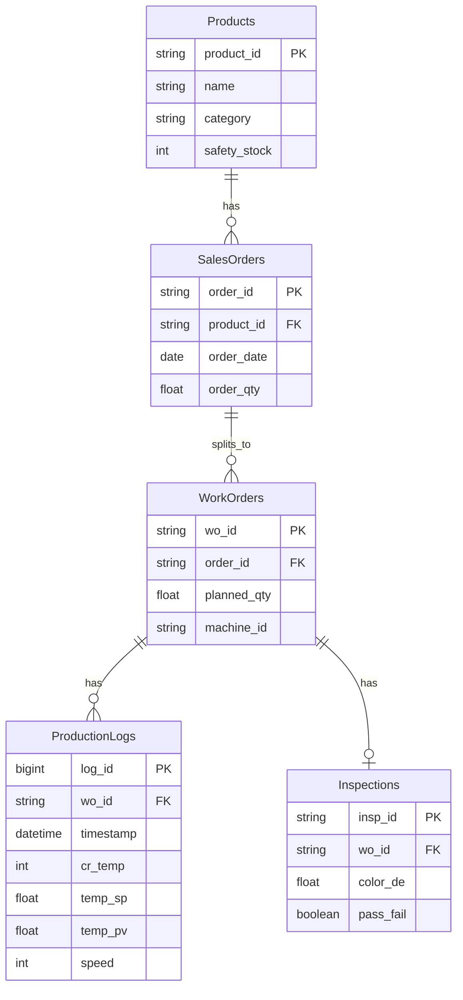

심플 MES(Simplified MES) 프로젝트의 정합성 확보를 위한 통합 데이터베이스 스키마 정의서입니다. 본 문서는 에스윈텍의 주문 관리 구조와 의류 염색 공정의 실행 데이터를 결합하여 설계되었습니다.

## 심플 MES 통합 데이터베이스 스키마 정의서

### 1. 개요 및 설계 원칙

- 목적: 수주(Planning)와 현장 실행(Execution) 데이터 간의 단절 없는 정보 흐름 구현.
- 설계 원칙: 에스윈텍의 주문 체계를 상위 엔티티로, 의류 공정의 로트(LOT) 실적을 하위 엔티티로 구성하여 1:N 관계를 형성함.
- 데이터 출처: 에스윈텍 고객사 주문량 데이터셋, 의류 공정최적화 AI 데이터셋.

### 2. 상세 테이블 명세

### 2.1 제품 마스터 (Products)

에스윈텍의 비공개 모델 코드를 의류 제품군으로 재정의하여 관리합니다.

| 컬럼명 | 타입 | 설명 | 출처 데이터 항목 |
| --- | --- | --- | --- |
| product_id (PK) | VARCHAR | 제품 고유 코드 | 에스윈텍 `code`, 의류 `공정코드`(에스윈텍 측 값이 없을 때 의류 데이터의 `공정코드`로 대치) |
| name | VARCHAR | 제품명 (예: 고신축 폴리 원단) | 에스윈텍 `name`, 의류 `작업명`(에스윈텍 측 값이 없을 때 의류 데이터의 `작업명`으로 대치) |
| category | VARCHAR | 제품 계층/분류 | 에스윈텍 `hierarchy` |
| safety_stock | INT | 적정 안전 재고량 | 에스윈텍 `safety_stock` |

### 2.2 수주 관리 (SalesOrders)

에스윈텍의 주문 구조를 기반으로 하며, 수량은 의류 공정의 일일 생산 합계로 동기화합니다.

| 컬럼명 | 타입 | 설명 | 출처 데이터 항목 |
| --- | --- | --- | --- |
| order_id (PK) | VARCHAR | 수주 고유 번호 | 에스윈텍 `uid` |
| product_id (FK) | VARCHAR | 제품 외래키 | 에스윈텍 `code` |
| order_date | DATE | 주문 발생 일자 | 에스윈텍 `date` |
| order_qty | FLOAT | 일일 확정 주문량 (집계값) | 의류 `염색 가동 길이` 합계 |

### 2.3 작업 지시 (WorkOrders)

수주된 물량을 생산하기 위한 현장의 로트 단위 작업 지시입니다.

| 컬럼명 | 타입 | 설명 | 출처 데이터 항목 |
| --- | --- | --- | --- |
| wo_id (PK) | VARCHAR | 작업 지시/LOT 번호 | 의류 `PRODT_ORDER_NO` |
| order_id (FK) | VARCHAR | 연관 수주 번호 | (데이터 생성 시 매핑) |
| planned_qty | FLOAT | LOT별 계획 생산량 | 의류 `염색 가동 길이` |
| machine_id | VARCHAR | 할당 설비 번호 | 의류 `RESOURCE_CD` |

### 2.4 공정 실행 로그 (ProductionLogs)

현장 설비에서 1분 주기로 수집되는 시계열 데이터입니다.

| 컬럼명 | 타입 | 설명 | 출처 데이터 항목 |
| --- | --- | --- | --- |
| log_id (PK) | BIGINT | 로그 고유 ID | (자동 생성) |
| wo_id (FK) | VARCHAR | 작업 지시 외래키 | 의류 `LOT_NO` |
| timestamp | DATETIME | 수집 일시 (1분 단위) | 의류 `INSRT_DT` |
| cr_temp | INT | 설비 가동 목표온도(℃) | 의류 `CR_TEMP` |
| temp_sp | FLOAT | 설비 가동 지시온도(℃) | 의류 `TRD_TEMP_SP` |
| temp_pv | FLOAT | 설비 현재 온도(실측, ℃) | 의류 `TRD_TEMP_PV` |
| speed | INT | 설비 가동 속도 | 의류 `TRD_SPEED1` |

### 2.5 품질 검사 결과 (Inspections)

공정 완료 후 기록되는 최종 품질 데이터입니다.

| 컬럼명 | 타입 | 설명 | 출처 데이터 항목 |
| --- | --- | --- | --- |
| insp_id (PK) | VARCHAR | 검사 고유 번호 | (자동 생성) |
| wo_id (FK) | VARCHAR | 작업 지시 외래키 | 의류 `lot_no` |
| color_de | FLOAT | 종합 색상 차이 지수 | 의류 `염색 색차 DE` |
| pass_fail | BOOLEAN | 합격 여부 (DE < 1.0 기준) | 의류 `염색 색차 DE` 판정 |

---

### 3. ER 다이어그램

아래 다이어그램은 **§2 상세 테이블 명세에 나온 엔티티·컬럼만** 표현한다. (과거 초안에 있던 `Machines`, `ProcessStatus` 등 §2에 없는 개체는 제거하였다.)

